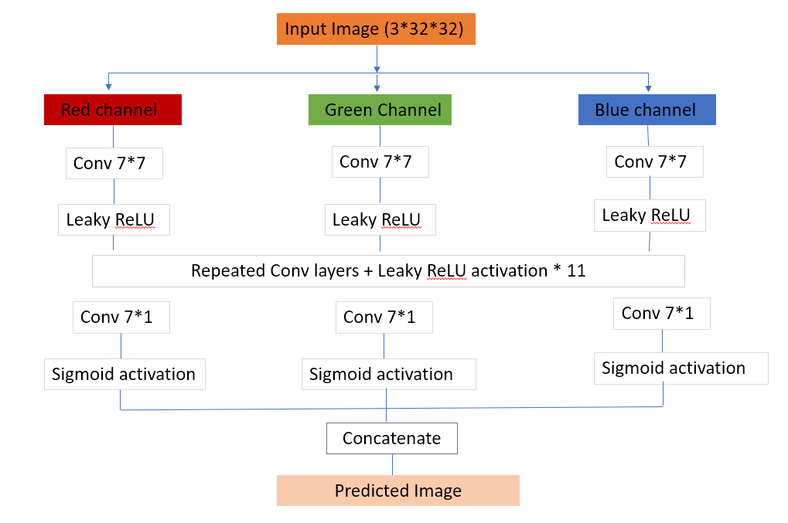
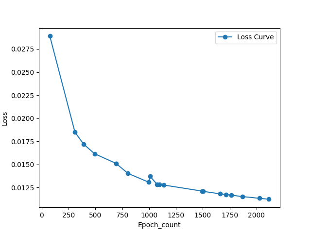
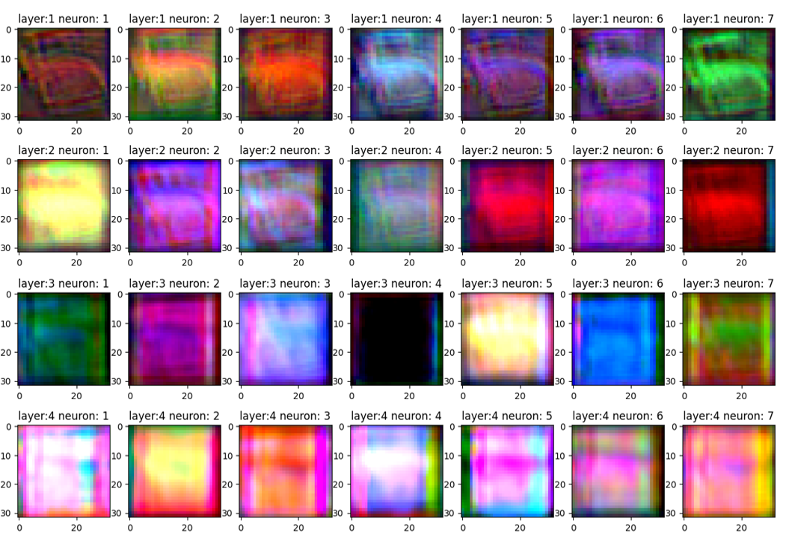
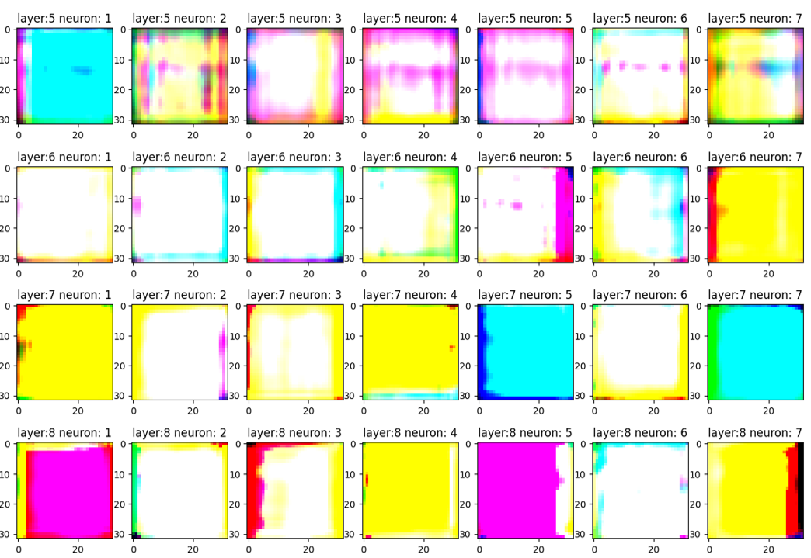
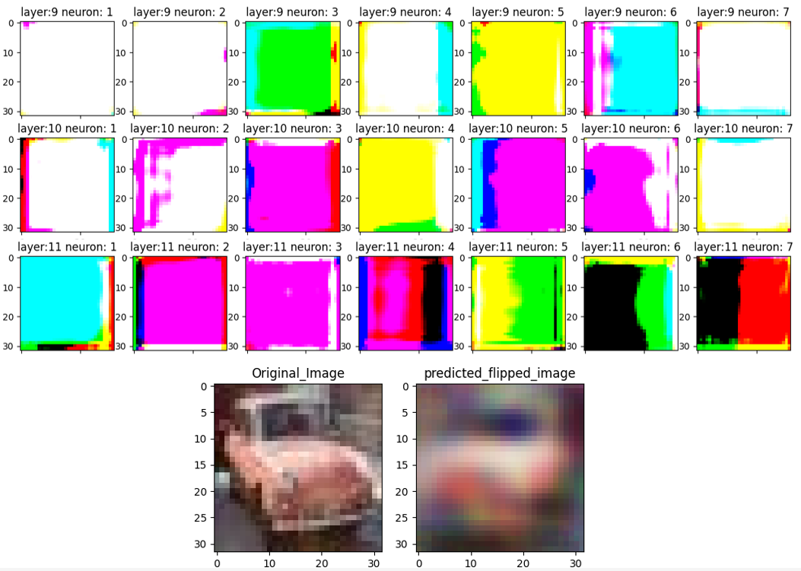
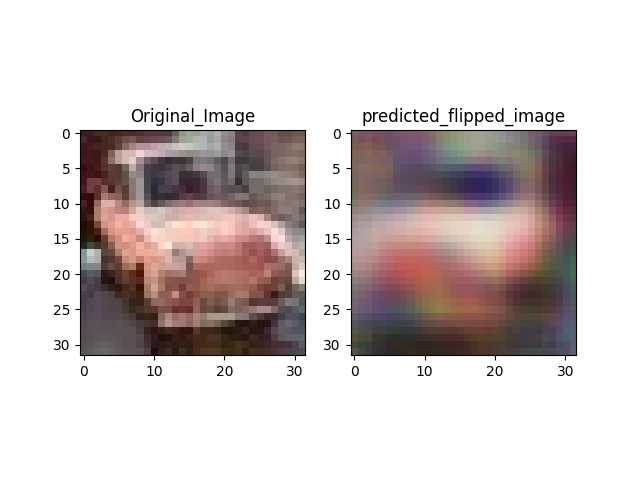
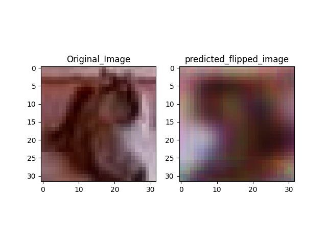
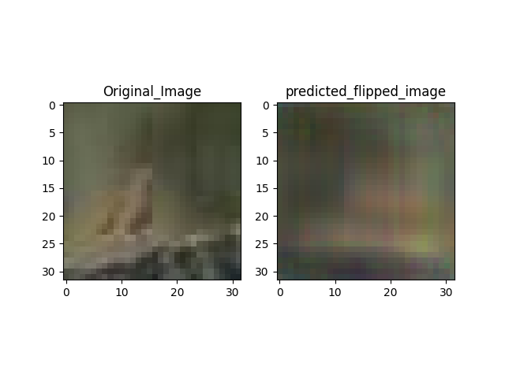
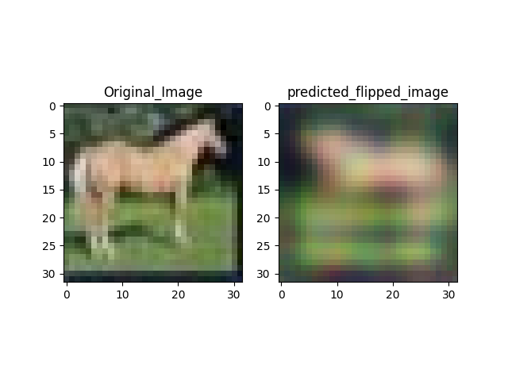
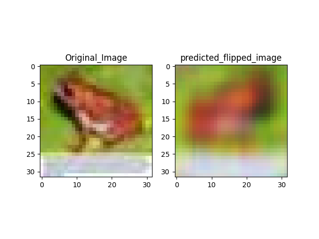

# Probing Spatial Information Propagation in Deep Convolutional Architectures Through Horizontal Image Flipping

### Overview

This project explores whether a Convolutional Neural Network (CNN) can learn a deterministic spatial transformation — horizontal image flipping — directly from image pairs.

Although this transformation is simple to implement algorithmically, learning it using a CNN is an interesting problem because information from one side of the image must influence output pixels on the opposite side.
The main question explored in this project is:
Can a customized deep convolutional network which processes the 3 color channels separately learn a global spatial transformation when its receptive field covers the entire input image?

### Project Objective
The project was developed as an experiment to understand information propagation, receptive fields, deep convolutional architectures, and pixel-level image reconstruction.

A horizontal flip mathematically maps an input pixel at position:

(x, y) to: (x, W - 1 - y)

where W is the image width , also assuming python indexing starting from 0 .


### Initial Experiment

The first version of the model used:

- 7 convolutional layers
- 3 × 3 convolution kernels
- Large input images
- Separate processing of Red, Green, and Blue channels

The output images appeared blurred and showed only limited signs of spatial movement.
One major limitation was the network's receptive field.
For 7 convolutional layers using 3 × 3 kernels with stride 1, the theoretical receptive field is:
1 + 7 × (3 - 1) = 15  
Therefore, an output neuron could only receive information from approximately a 15 × 15 region of the original image.

This made it impossible for pixels on one side of a large image to influence pixels on the opposite side.

### Updated Architecture

To increase the receptive field, the architecture was redesigned.

Current Configuration:
- Input image size: 32 × 32
- 12 convolutional layers
- Kernel size: 7 × 7
- Stride: 1
- Padding: 3
- Hidden feature channels: 7
- Activation: LeakyReLU
- Final activation: Sigmoid
- Loss function: Mean Squared Error (MSE)
- Optimizer: Adam
- Learning rate: 1e-4

The network processes the Red, Green, and Blue channels through separate convolutional paths.
### Architecture 


### Receptive Field

For convolution layers with stride 1, the receptive field can be calculated as:

R = 1 + L × (K - 1)

where:

R = receptive field
L = number of convolution layers
K = kernel size

For the current network:

R = 1 + 12 × (7 - 1)

R = 73

The theoretical receptive field is therefore:

73 × 73

Since the input image is only:

32 × 32

every final output location can theoretically receive information originating from the entire input image.

This removes the receptive-field limitation present in the initial architecture.

### Dataset Preparation

The model is trained using image pairs generated dynamically.

For every input image:

Input  = Original Image processed from the classic CIFAR-10 dataset.  
Target = Horizontally Flipped Image

The target is generated using TorchVision:

transforms.RandomHorizontalFlip(p=1.0)

Setting the probability to 1.0 ensures that every target image is horizontally flipped.

Images are converted to tensors using:

transforms.ToTensor()

which scales pixel values to the range: [0, 1]


### Loss Function

The project uses Mean Squared Error:

nn.MSELoss()

The loss measures the pixel-wise difference between the predicted image and the actual horizontally flipped image.

Conceptually:
```text
Predicted Pixel ─┐
                 ├── Squared Difference → Average → Loss
Target Pixel ────┘
```
A lower loss indicates that the predicted image is becoming closer to the expected flipped image.

Below is the loss curve after we trained up to 2116 epochs.The model was trained with learning rate of 1e-4 which was reduced to 1e-5 after the losses were oscillating.


### Feature Map Visualization

The project includes a custom visualization pipeline for inspecting intermediate convolutional feature maps.  
Below are the feature maps visualized from layers 1 to 12 for the epoch count 2116 .




This was used to study:

How image information propagates through convolutional layers
How individual filters transform image features
Whether spatial information moves across the feature maps
How deeper layers represent the input image

### Technologies Used
- Python
- PyTorch
- TorchVision
- NumPy
- Pillow (PIL)
- Matplotlib


### Key Concepts Explored

This project helped explore and understand:

- Convolutional neural networks
- Receptive fields
- Spatial information propagation
- Image-to-image learning
- Pixel-level reconstruction
- Deep CNN architecture design
- Large convolution kernels
- LeakyReLU activation
- Sigmoid output activation
- Mean Squared Error loss
- Feature map visualization
- Model checkpointing
- GPU-based model training
### RESULTS 
Here are some original input images  and their final flipped image generated with the model.
The results shown below are for the epoch count 2116 , where the loss was coming around 0.0112  






### Experimental Observations

The initial 7-layer architecture with 3 × 3 kernels produced blurred outputs and struggled to perform the required spatial transformation.

The experiment suggested that the pixel information from one end couldn't be carried up to another end with that architecture.

The architecture was therefore expanded to 12 layers with 7 × 7 kernels and the dataset images were changed to 32 × 32 resolution.

The updated model provides a theoretical receptive field larger than the complete input image.

With this updated architecture it looked like the model is preserving the shapes like cars remain cars, dogs remain dogs. shapes can be observed also its looks like the images are getting flipped but it is lacking detailing too much. also the edges are not sharp and it can be observed that AI effect in the generated images due to MSE loss most probably
### Limitations

The current architecture processes the Red, Green, and Blue channels independently.

Therefore, intermediate convolutional layers cannot directly learn relationships between different color channels.

Additionally, although the theoretical receptive field covers the complete image, a standard convolutional architecture may still find it difficult to learn an exact global pixel permutation.

Theoretical receptive-field coverage only guarantees that information can propagate between distant positions. It does not guarantee that the optimization process will learn the required transformation.

### Future Experiments

Future versions of this project may explore:

- Joint RGB convolution using multi-channel kernels
- Dilated convolutions
- Encoder-decoder architectures
- Skip connections
- Residual connections
- Self-attention
- Vision Transformer-based spatial transformations
- Comparison of MSE and L1 loss
- Effective receptive field analysis
- Comparison between theoretical and learned information propagation

### Why This Project?

The goal of this project is not to find the easiest way to flip an image.

A horizontal flip can obviously be performed using a single image-processing operation.

Instead, the project uses flipping as a controlled experiment to study:

How does spatial information propagate through a deep convolutional neural network, and can a CNN learn an exact global geometric transformation?

### Author

#### Shubham Prakash

B.Tech Electrical Engineering  
National Institute of Technology Srinagar

Interested in Deep Learning, Computer Vision, and understanding neural networks from first principles.